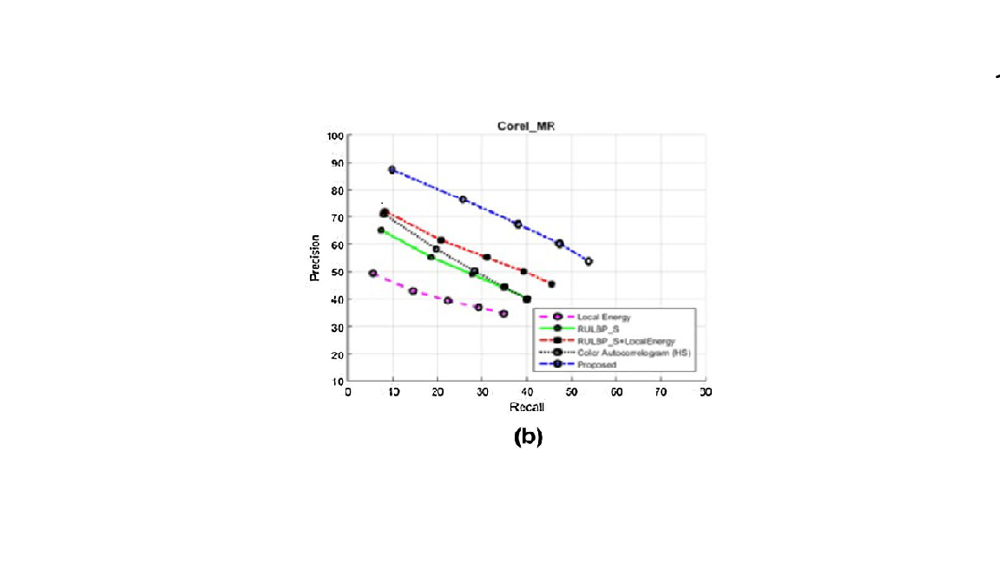
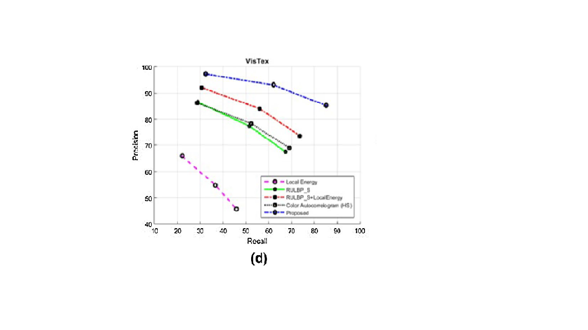

# Content‑based image retrieval using combined texture and colorfeatures based on multi‑resolution multi‑direction filtering and color autocorrelogram.
Abbreviations
* RULBP Rotation-invariant uniform local binary patterns
* MRMD Multi-resolution multi-direction
* LBP Local binary patterns
* DB Database
## Output
The precision vs. recall for comparing the partial features of the proposed method with the proposed method for six DBs: a Corel, b
Corel_MR, c Corel_MD, d VisTex, e VisTex_MR, and f VisTex_MD:

## References
[Research paper link](https://link.springer.com/article/10.1007/s12652-019-01466-0)
 Published:18 October 2019
